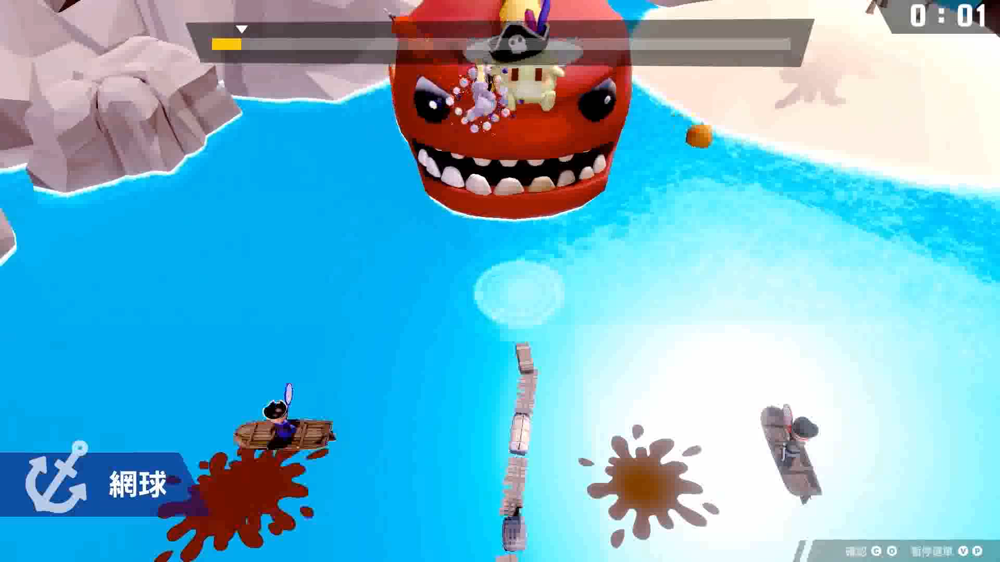
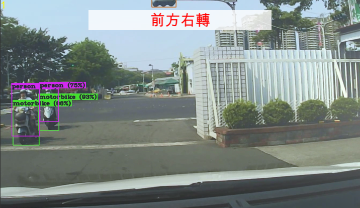

# Portfolio-Code
## 體感遊戲---《夢盡》
### 研究目標
針對下班後的休閒娛樂是靜態活動這項問題，本專題利用體感遊戲以下幾項特點：不會呆坐在螢幕前、全身性的活動、不須任何配戴性裝置，不會造成額外負擔，設計一款以體感為基礎的RPG小遊戲，希望能改善大家的休閒娛樂型態，讓大家在玩遊戲放鬆身心之餘，也能夠活動身體減少久坐帶來的危害。
### 專案特色
使用者透過身體的肢體動作來控制遊戲中角色的動作，進而增加使用者的活動量，並且使其也能達到身心娛樂的效果。
### 專案成果
- [x] 遊戲畫面、遊戲地形場景、角色及怪物等RPG遊戲基礎設定建置完成。
- [x] 設置五種怪物，並加入AI系統(自動巡路與偵測攻擊範圍)，以 10 秒為單位生成一批共計 10 隻。
- [x] 角色行為與體感設備相結合設定完成。
### 負責工作
1. 玩家角色建模
2. 玩家角色與怪物動畫設定
3. 玩家與怪物戰鬥與行為模式相關程式撰寫。
### 使用技術
1. Unity3D
2. C#
3. makehuman
### 負責工作內容相關Code
- [角色控制(PlayerMove.cs)](https://github.com/xgru/Portfolio-Code/blob/main/%E3%80%8A%E5%A4%A2%E7%9B%A1%E3%80%8B/PlayerMove.cs)
- [角色控制(MoveController.cs)](https://github.com/xgru/Portfolio-Code/blob/main/%E3%80%8A%E5%A4%A2%E7%9B%A1%E3%80%8B/MoveController.cs)
- [攻擊控制(AttackController.cs)](https://github.com/xgru/Portfolio-Code/blob/main/%E3%80%8A%E5%A4%A2%E7%9B%A1%E3%80%8B/AttackController.cs)
- [防禦控制(BlockController.cs)](https://github.com/xgru/Portfolio-Code/blob/main/%E3%80%8A%E5%A4%A2%E7%9B%A1%E3%80%8B/BlockController.cs)
- [角色武器切換(SwordSwitch.cs)](https://github.com/xgru/Portfolio-Code/blob/main/%E3%80%8A%E5%A4%A2%E7%9B%A1%E3%80%8B/SwordSwitch.cs)
- [武器揮動軌跡控制(WeaponTrailController.cs)](https://github.com/xgru/Portfolio-Code/blob/main/%E3%80%8A%E5%A4%A2%E7%9B%A1%E3%80%8B/WeaponTrailController.cs)
- [怪物AI控制(goblin_DrawArc.cs)](https://github.com/xgru/Portfolio-Code/blob/main/%E3%80%8A%E5%A4%A2%E7%9B%A1%E3%80%8B/goblin_DrawArc.cs)
- [怪物AI控制(goblinAI.cs)](https://github.com/xgru/Portfolio-Code/blob/main/%E3%80%8A%E5%A4%A2%E7%9B%A1%E3%80%8B/goblinAI.cs)
- [怪物生成控制(MonsterBorn.cs)](https://github.com/xgru/Portfolio-Code/blob/main/%E3%80%8A%E5%A4%A2%E7%9B%A1%E3%80%8B/MonsterBorn.cs)
- [攝影機控制(CameraController.cs)](https://github.com/xgru/Portfolio-Code/blob/main/%E3%80%8A%E5%A4%A2%E7%9B%A1%E3%80%8B/CameraController.cs)
- [攝影機跟隨控制(SmoothFollow.cs)](https://github.com/xgru/Portfolio-Code/blob/main/%E3%80%8A%E5%A4%A2%E7%9B%A1%E3%80%8B/SmoothFollow.cs)
### 成果影片

## 超休閒小遊戲---《海賊七逃》
### 研究目標
以超休閒小遊戲為目標，訂定七款不同運動類型的雙人同樂小遊戲，兩個月時間程式美術製作，一個月整合、修改。
### 專案特色
包含棒球、網球、拳擊、射箭、劍道、跳水、田徑七種小遊戲，可愛的海盜形象、趣味角色動作，進行與傳統運動場模式相異的比賽形式，展開一場在海上的奧林匹克。
### 專案成果
- [x] 完成遊戲企劃內容。
- [x] 各程式、美術人員各自完成負責物件及遊戲程式撰寫。
- [x] 進行全面整合與修改問題，確認可以遊玩。
- [x] 錄製宣傳影片完成。
### 負責工作
網球遊戲關卡程式設計
### 使用技術
1. Unity3D
2. C#
### 負責工作內容相關Code
- [船控制(BoatController.cs)](https://github.com/xgru/Portfolio-Code/blob/main/%E3%80%8A%E6%B5%B7%E8%B3%8A%E4%B8%83%E9%80%83%E3%80%8B/BoatController.cs)
- [Boss控制(BossController.cs)](https://github.com/xgru/Portfolio-Code/blob/main/%E3%80%8A%E6%B5%B7%E8%B3%8A%E4%B8%83%E9%80%83%E3%80%8B/BossController.cs)
- [遊戲結果控制(GameReasult.cs)](https://github.com/xgru/Portfolio-Code/blob/main/%E3%80%8A%E6%B5%B7%E8%B3%8A%E4%B8%83%E9%80%83%E3%80%8B/GameReasult.cs)
- [物件控制(ObjectController.cs)](https://github.com/xgru/Portfolio-Code/blob/main/%E3%80%8A%E6%B5%B7%E8%B3%8A%E4%B8%83%E9%80%83%E3%80%8B/ObjectController.cs)
- [物件生成(ObjectCreate.cs)](https://github.com/xgru/Portfolio-Code/blob/main/%E3%80%8A%E6%B5%B7%E8%B3%8A%E4%B8%83%E9%80%83%E3%80%8B/ObjectCreate.cs)
- [物件池(ObjectPool.cs)](https://github.com/xgru/Portfolio-Code/blob/main/%E3%80%8A%E6%B5%B7%E8%B3%8A%E4%B8%83%E9%80%83%E3%80%8B/ObjectPool.cs)
- [角色控制(PlayerController.cs)](https://github.com/xgru/Portfolio-Code/blob/main/%E3%80%8A%E6%B5%B7%E8%B3%8A%E4%B8%83%E9%80%83%E3%80%8B/PlayerController.cs)
- [污漬控制(StainController.cs)](https://github.com/xgru/Portfolio-Code/blob/main/%E3%80%8A%E6%B5%B7%E8%B3%8A%E4%B8%83%E9%80%83%E3%80%8B/StainController.cs)
### 成果影片

## 影像式駕駛訓練模擬系統
### 研究目標
考量到實際上路練習的危險性以及解決在傳統駕駛訓練班培訓所遇到的困擾因素，提供一項簡單便利、可自由進行多樣化駕駛訓練的模擬環境系統，以幫助駕駛員認識到自身的駕駛行為問題。
### 專案特色
採用物件偵測與光流計算技術，以行車紀錄影片作為駕駛訓練素材，使系統自動化分析影片中行車行進方向，偵測出左轉、右轉、直行與靜止狀態，於確切的時間點給予駕駛員行進提示，並即時偵測駕駛員是否完成確切的駕駛行為，若有未完成動作，將會顯示於畫面上。在訓練結束後畫面上將會顯示系統所統計出的所有駕駛員錯誤行為資訊提供駕駛員參考了解。
### 專案成果
- [x] 進行物件偵測確認問題物件的座標資訊
- [x] 進行光流計算分析行車方向
- [x] 進行行車狀態種類、發生時間與結束時間判斷
- [x] 將數據結果導入Unity3D中進行系統製作
- [x] 訊息畫面顯示以及即時判別駕駛行為正確與否
- [x] 統整並顯示所有錯誤駕駛行為時間與內容

### 負責工作
全部
### 使用技術
1. YOLOv4
2. 光流計算
3. Unity3D
4. C#
### 負責工作內容相關Code
無法提供
### 成果影片

