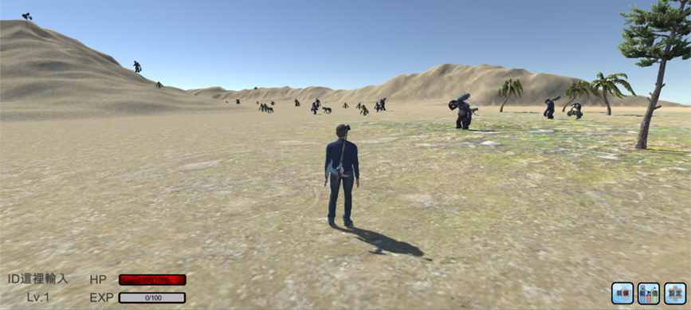

# Portfolio-Code
## 體感遊戲---《夢盡》
### 研究目標
針對下班後的休閒娛樂是靜態活動這項問題，本專題利用體感遊戲以下幾項特點：不會呆坐在螢幕前、全身性的活動、不須任何配戴性裝置，不會造成額外負擔，設計一款以體感為基礎的RPG小遊戲，希望能改善大家的休閒娛樂型態，讓大家在玩遊戲放鬆身心之餘，也能夠活動身體減少久坐帶來的危害。
### 專案特色
使用者透過身體的肢體動作來控制遊戲中角色的動作，進而增加使用者的活動量，並且使其也能達到身心娛樂的效果。
### 專案成果
- [x] 遊戲畫面、遊戲地形場景、角色及怪物等RPG遊戲基礎設定建置完成。
- [x] 設置五種怪物，並加入AI系統(自動巡路與偵測攻擊範圍)，以 10 秒為單位生成一批共計 10 隻。
- [x] 角色行為與體感設備相結合設定完成。
### 負責工作
1. 玩家角色建模
2. 玩家角色與怪物動畫設定
3. 玩家與怪物戰鬥與行為模式相關程式撰寫。
### 使用技術
1. Unity3D
2. C#
3. makehuman
### 負責工作內容相關Code
- A
- 

